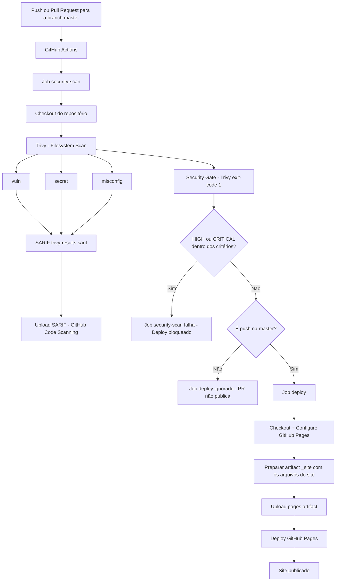

# Portfólio Pessoal — Hérisson Silva

Site pessoal e portfólio profissional de **Antonio Herisson Silva Morais** (apresentação: **Hérisson Silva**), profissional de TI atuante em **Cloud | DevOps | Infraestrutura | Suporte**.

## Sobre o projeto

Este repositório contém um site estático que funciona como portfólio profissional de tecnologia. O site apresenta trajetória, experiência, competências, projetos, formação, certificações e formas de contato, servindo como porta de entrada para os projetos públicos no GitHub.

## Evolução do projeto

A história deste projeto segue a seguinte evolução:

```text
Bootcamp DIO + Carrefour
        ↓
Primeiro site pessoal
        ↓
Ideia inicial de site/blog
        ↓
Evolução profissional
        ↓
Modernização do projeto
        ↓
Portfólio profissional
        ↓
GitHub Pages
        ↓
Security Pipeline
        ↓
CI/CD + DevSecOps
```

**Este projeto iniciou tendo como foco a montagem de um site pessoal e foi iniciado no Bootcamp da DIO em parceria com Carrefour.**

Naquele momento, a intenção inicial era transformar o site em uma espécie de blog pessoal, com uma área de posts. Essa ideia foi abandonada, e o projeto foi modernizado e transformado em um portfólio profissional estático de tecnologia.

## Objetivo atual

O projeto atualmente tem como objetivo:

- funcionar como portfólio profissional;
- apresentar a trajetória profissional;
- apresentar competências e níveis de conhecimento;
- apresentar certificações e formações;
- apresentar projetos reais;
- centralizar links profissionais (LinkedIn, GitHub e e-mail);
- direcionar visitantes para os projetos no GitHub.

O site promove uma experiência focada em: **quem sou → experiência → impacto profissional → competências → projetos → formação/certificações → como entrar em contato.**

## Tecnologias utilizadas

- HTML5
- CSS3
- Bootstrap 5 (arquivos locais em `bootstrap/`)
- JavaScript simples (utilizado apenas para o menu responsivo do Bootstrap e data dinâmica no footer)

O projeto **não** utiliza frameworks JavaScript, build tools ou dependências de backend. É um site 100% estático.

## Estrutura

```text
Site-Pessoal/
├── .github/
│   └── workflows/
│       └── security.yml
├── assets/
│   └── img/
│       ├── favicon.svg
│       └── herisson.png
├── bootstrap/
│   ├── css/
│   └── js/
├── css/
│   └── style.css
├── index.html
└── README.md
```

## Executando localmente

Como o projeto é estático, basta abrir o `index.html` diretamente no navegador ou servir a pasta com um servidor estático simples:

```bash
# Python
python -m http.server 8000

# PHP
php -S localhost:8000
```

## Portfólio

Os projetos apresentados no site são trabalhos reais de atuação com infraestrutura, automação, CI/CD e Cloud, como:

- **HSAgendamentos** — projeto freelancer com Docker Compose, Linux, Nginx, MariaDB, APIs e Trivy.
- **Automação de deploy com Jenkins** — pipeline CI/CD com Jenkins, GitHub, Linux e Shell Script.

Novos repositórios e projetos serão adicionados à medida que forem organizados no GitHub.

## Publicação

O site está publicado através do **GitHub Pages** e pode ser acessado em:

**https://herissons.github.io/Site-Pessoal/**

A publicação é automatizada pelo **GitHub Actions**: após as verificações de segurança serem aprovadas em um push para `master`, o workflow prepara e publica o site de forma automática. A fonte de publicação configurada no repositório é **GitHub Actions**.

O site é totalmente estático, sem dependência de backend, banco de dados ou processamento no servidor, e nenhuma credencial ou dado sensível é versionado.

## CI/CD e DevSecOps

O repositório conta com um **workflow de CI/CD + DevSecOps** executado pelo **GitHub Actions**. Alterações destinadas à branch `master` passam por verificações automatizadas de segurança (**security scan** + **security gate**) e, quando aprovadas em um push válido para `master`, o site é publicado automaticamente no **GitHub Pages**.

- [](https://github.com/HerissonS/Site-Pessoal/actions/workflows/security.yml)

### Objetivo

Automatizar segurança e publicação em duas etapas complementares:

1. **Continuous Integration / Security** — executar o security scan com o Trivy, gerar resultados em SARIF para o GitHub Code Scanning e aplicar o security gate (bloqueio por severidade).
2. **Continuous Deployment** — após aprovação do security gate em um push para `master`, preparar e publicar o site no GitHub Pages.

> O workflow automatiza verificações de segurança e pode bloquear alterações que atendam aos critérios configurados. Ele **não garante** a ausência de vulnerabilidades no site.

### Triggers e branch

O workflow `.github/workflows/security.yml` é disparado por:

- `push` na branch `master`;
- `pull_request` aberto para a branch `master`.

A branch `master` é a branch principal deste repositório.

### Fluxo (Security Scan → Security Gate → Deploy)



### Jobs e permissões (menor privilégio)

```yaml
permissions:
  contents: read            # nível do workflow: padrão mínimo para todos os jobs

jobs:
  security-scan:
    permissions:
      contents: read         # checkout dos arquivos para análise
      security-events: write # upload do SARIF / GitHub Code Scanning

  deploy:
    permissions:
      contents: read         # checkout dos arquivos do site
      id-token: write        # autenticação OIDC para publicar no Pages
      pages: write           # iniciar e executar o deployment do Pages
```

Os jobs possuem **permissões separadas**, seguindo o princípio de menor privilégio:

- o job `security-scan` recebe apenas o necessário para ler o código e enviar resultados de segurança — ele **não** pode publicar o site (sem `pages: write` e `id-token: write`);
- o job `deploy` recebe apenas o necessário para ler o código e publicar no GitHub Pages — ele **não** pode escrever eventos de segurança (sem `security-events: write`).

Isso garante o isolamento entre as responsabilidades: o job de análise não publica, e o job de deploy não registra alertas de segurança.

### Continuous Integration / Security

O job `security-scan` executa o **Trivy** no modo **Filesystem Scan** (`scan-type: fs`, `scan-ref: .`) com os scanners `vuln`, `secret` e `misconfig`:

- `vuln` — vulnerabilidades conhecidas em dependências e artefatos detectáveis pelo Trivy;
- `secret` — busca padrões de tokens, senhas, API keys e credenciais;
- `misconfig` — verifica configurações em arquivos suportados (IaC, Docker, Kubernetes etc.).

Os achados são filtrados pelas severidades **HIGH** e **CRITICAL**, com `ignore-unfixed: true` (somente vulnerabilidades com correção publicada).

Depois do scan:

1. o primeiro scan gera `trivy-results.sarif` com `exit-code: 0` (sem interromper a execução) e o arquivo é enviado com `upload-sarif` ao **GitHub Code Scanning** (com `if: always()`);
2. o segundo scan usa `format: table` e `exit-code: 1`, funcionando como **security gate**: o job falha quando existem achados dentro dos critérios configurados.

### Continuous Deployment

O job `deploy` tem `needs: security-scan`, portanto só executa se o security scan terminar com sucesso. Além disso, ele só é executado em **push para `master`** (condição `github.event_name == 'push' && github.ref == 'refs/heads/master'`).

Etapas do deploy:

- `actions/configure-pages` — configura o ambiente de publicação do GitHub Pages;
- preparação do artifact com **somente os arquivos do site** (`index.html`, `css/`, `bootstrap/`, `assets/`) em `_site/`;
- `actions/upload-pages-artifact` — envia o artifact de publicação;
- `actions/deploy-pages` — publica o site e expõe a URL do deployment.

O deploy usa o environment **`github-pages`**, com a URL exposta a partir do output oficial `page_url` da action de deploy.

### Comportamento em Pull Requests e push para `master`

- **Pull Request → `master`**: executa o security scan, gera o SARIF e aplica o security gate. O job `deploy` é ignorado (a condição `github.event_name == 'push'` não é atendida), portanto **um PR nunca publica o site**.
- **Push → `master` aprovado**: security scan + security gate aprovados → job `deploy` executa → site publicado no GitHub Pages.
- **Push → `master` reprovado**: o security gate falha o job `security-scan`; por causa do `needs: security-scan`, o job `deploy` é bloqueado (skipped) e a última versão já publicada no site permanece ativa.

### Concorrência

O job `deploy` define `concurrency` com o grupo `pages` e `cancel-in-progress: false`. Isso evita deployments concorrentes do GitHub Pages: se dois pushes acontecerem em sequência, o segundo aguarda o primeiro terminar antes de fazer novo deploy.

### Limitações do scan neste repositório

Este é um site estático e não possui arquivos como `package.json`, `requirements.txt`, `composer.json` ou outros manifestos de dependências gerenciados. Por isso:

- o scanner `vuln` tem **alcance limitado** neste projeto, pois há pouco material de dependência analisável;
- o scanner `secret` **mantém utilidade**, validando que nenhuma credencial ou token seja versionado;
- o scanner `misconfig` depende dos arquivos de configuração suportados existentes no repositório.

A pipeline **não** realiza: teste completo de SAST, DAST, pentest, scan da aplicação publicada, scan de imagens Docker ou análise dinâmica.

### Relação com o GitHub Pages

A pipeline **unifica segurança e publicação** no fluxo do GitHub Pages:

- alterações em `master` passam pelo security scan e pelo security gate;
- o deploy só acontece após a aprovação das verificações, em push para `master`;
- a fonte de publicação configurada no repositório é **GitHub Actions**, e o workflow também é responsável por publicar o site.

### Conceitos (resumo)

- **GitHub Actions** — plataforma de automação do GitHub. Neste projeto, executa o workflow de segurança e publicação a cada push/PR para `master`.
- **Trivy** — scanner de segurança open source, utilizado no modo **Filesystem Scan** (`scan-type: fs`, `scan-ref: .`), que analisa os arquivos do próprio repositório no runner. É adequado para este projeto estático por não exigir imagem de contêiner ou dependências externas.
- **SARIF** — formato aberto de troca de resultados de análise, consumido pelo GitHub Code Scanning.
- **Security Gate** — o parâmetro `exit-code: 1` no scan de tabela faz a execução falhar quando existem achados dentro dos critérios configurados, bloqueando o deploy.

### Melhorias futuras (não aplicadas)

- fixar (pin) as Actions por **commit SHA**, em vez de tags como `@v4`, como hardening de supply chain;
- unificar os dois scans do Trivy em um único scan com `if: always()` no upload, reutilizando o mesmo relatório para SARIF e security gate — reduziria o tempo de execução;
- atualizar periodicamente as versões das Actions utilizadas para manter compatibilidade com o runtime do GitHub;
- avaliar, em momento futuro, ferramentas complementares (ex.: Dependabot e CodeQL), fora do escopo atual.

## Autor

**Hérisson Silva** — Cloud | DevOps | Infraestrutura | Suporte

- E-mail: antonioherisson@gmail.com
- LinkedIn: [linkedin.com/in/herisson-silva-7275a0187](https://www.linkedin.com/in/herisson-silva-7275a0187/)
- GitHub: [github.com/HerissonS](https://github.com/HerissonS)