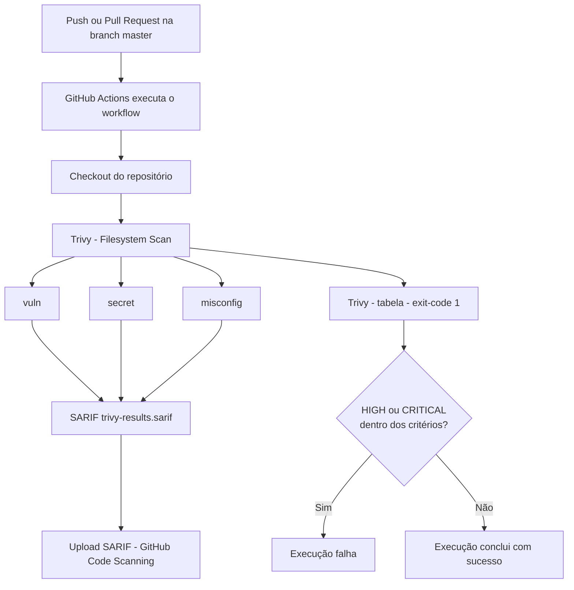

# Portfólio Pessoal — Hérisson Silva

Site pessoal e portfólio profissional de **Antonio Herisson Silva Morais** (apresentação: **Hérisson Silva**), profissional de TI atuante em **Cloud | DevOps | Infraestrutura | Suporte**.

## Sobre o projeto

Este repositório contém um site estático que funciona como portfólio profissional de tecnologia. O site apresenta trajetória, experiência, competências, projetos, formação, certificações e formas de contato, servindo como porta de entrada para os projetos públicos no GitHub.

## Evolução do projeto

A história deste projeto segue a seguinte evolução:

```text
Bootcamp DIO + Carrefour
        ↓
Primeiro site pessoal
        ↓
Ideia inicial de site/blog
        ↓
Evolução profissional
        ↓
Modernização do projeto
        ↓
Portfólio profissional
        ↓
Publicação via GitHub Pages
        ↓
Práticas DevSecOps
```

**Este projeto iniciou tendo como foco a montagem de um site pessoal e foi iniciado no Bootcamp da DIO em parceria com Carrefour.**

Naquele momento, a intenção inicial era transformar o site em uma espécie de blog pessoal, com uma área de posts. Essa ideia foi abandonada, e o projeto foi modernizado e transformado em um portfólio profissional estático de tecnologia.

## Objetivo atual

O projeto atualmente tem como objetivo:

- funcionar como portfólio profissional;
- apresentar a trajetória profissional;
- apresentar competências e níveis de conhecimento;
- apresentar certificações e formações;
- apresentar projetos reais;
- centralizar links profissionais (LinkedIn, GitHub e e-mail);
- direcionar visitantes para os projetos no GitHub.

O site promove uma experiência focada em: **quem sou → experiência → impacto profissional → competências → projetos → formação/certificações → como entrar em contato.**

## Tecnologias utilizadas

- HTML5
- CSS3
- Bootstrap 5 (arquivos locais em `bootstrap/`)
- JavaScript simples (utilizado apenas para o menu responsivo do Bootstrap e data dinâmica no footer)

O projeto **não** utiliza frameworks JavaScript, build tools ou dependências de backend. É um site 100% estático.

## Estrutura

```text
Site-Pessoal/
├── .github/
│   └── workflows/
│       └── security.yml
├── assets/
│   └── img/
│       ├── favicon.svg
│       └── herisson.png
├── bootstrap/
│   ├── css/
│   └── js/
├── css/
│   └── style.css
├── index.html
└── README.md
```

## Executando localmente

Como o projeto é estático, basta abrir o `index.html` diretamente no navegador ou servir a pasta com um servidor estático simples:

```bash
# Python
python -m http.server 8000

# PHP
php -S localhost:8000
```

## Portfólio

Os projetos apresentados no site são trabalhos reais de atuação com infraestrutura, automação, CI/CD e Cloud, como:

- **HSAgendamentos** — projeto freelancer com Docker Compose, Linux, Nginx, MariaDB, APIs e Trivy.
- **Automação de deploy com Jenkins** — pipeline CI/CD com Jenkins, GitHub, Linux e Shell Script.

Novos repositórios e projetos serão adicionados à medida que forem organizados no GitHub.

## Publicação

O site está publicado através do **GitHub Pages** e pode ser acessado em:

**https://herissons.github.io/Site-Pessoal/**

O projeto foi preparado tecnicamente para funcionar em subdiretório do GitHub Pages:

- site totalmente estático;
- nenhuma dependência de backend, banco de dados ou processamento no servidor;
- nenhuma credencial ou dado sensível versionado.

## DevSecOps Security Pipeline

O repositório conta com uma **pipeline DevSecOps de segurança** executada pelo **GitHub Actions**, utilizando o **Trivy** para análise dos arquivos do repositório e integração com o **GitHub Code Scanning**.

- [](https://github.com/HerissonS/Site-Pessoal/actions/workflows/security.yml)

### Objetivo

Automatizar verificações de segurança nas alterações do repositório, separando duas responsabilidades:

1. **Visibilidade** — gerar e enviar um relatório SARIF para o GitHub Code Scanning.
2. **Controle de bloqueio (security gate)** — falhar a execução quando forem encontrados achados dentro dos critérios configurados.

> O workflow automatiza verificações de segurança e pode bloquear alterações que atendam aos critérios configurados. Ele **não garante** a ausência de vulnerabilidades no site.

### Triggers e branch

O workflow `.github/workflows/security.yml` é disparado por:

- `push` na branch `master`;
- `pull_request` aberto para a branch `master`.

A branch `master` é a branch principal deste repositório.

### Como funciona



### Permissões

```yaml
permissions:
  contents: read
  security-events: write
```

- `contents: read` — necessário para o `actions/checkout@v4` disponibilizar o conteúdo do repositório no runner;
- `security-events: write` — necessário para o `github/codeql-action/upload-sarif@v4` registrar os alertas de code scanning.

As permissões seguem o princípio do menor privilégio: nenhuma outra permissão é concedida a este job.

### Scanners do Trivy

- `vuln` — identifica vulnerabilidades conhecidas em dependências e artefatos que o Trivy consiga detectar;
- `secret` — busca padrões associados a tokens, senhas, API keys, credenciais e outras informações sensíveis;
- `misconfig` — verifica configurações em arquivos suportados pelo Trivy (IaC, Docker, Kubernetes, entre outros).

Os achados são filtrados pelas severidades **HIGH** e **CRITICAL**. Com `ignore-unfixed: true`, somente vulnerabilidades que possuem correção disponível são consideradas (aplicável principalmente a pacotes com fix publicado).

### SARIF e GitHub Code Scanning

O primeiro scan exporta os achados no formato **SARIF** (*Static Analysis Results Interchange Format*), um padrão aberto para a troca de resultados de ferramentas de análise. O arquivo `trivy-results.sarif` é enviado ao GitHub com `upload-sarif` e passa a ser exibido como alertas na aba **Security** (Code Scanning) do repositório.

O passo de upload usa `if: always()`, garantindo que o relatório seja enviado mesmo que um passo anterior falhe. A efetiva exibição dos alertas depende dos recursos de Code Scanning disponíveis na conta/repositório do GitHub.

O primeiro scan usa `exit-code: 0` justamente para não interromper o job apenas pelos achados configurados, permitindo que o relatório SARIF seja gerado e enviado.

### Security Gate

O segundo scan é executado com `format: table` e `exit-code: 1`. Diferente do primeiro scan, este converte os achados em **controle de bloqueio**: se forem encontrados achados HIGH/CRITICAL dentro dos critérios configurados, a etapa falha e o job é reprovado — o que pode bloquear o merge do PR caso haja proteção de branch configurada.

```text
Primeiro scan (SARIF) → visibilidade dos achados
Segundo scan (tabela) → controle de bloqueio da execução
```

### Limitações do scan neste repositório

Este é um site estático e não possui arquivos como `package.json`, `requirements.txt`, `composer.json` ou outros manifestos de dependências gerenciados. Por isso:

- o scanner `vuln` tem **alcance limitado** neste projeto, pois há pouco material de dependência analisável;
- o scanner `secret` **mantém utilidade**, validando que nenhuma credencial ou token seja versionado;
- o scanner `misconfig` depende dos arquivos de configuração suportados existentes no repositório.

A pipeline **não** realiza: teste completo de SAST, DAST, pentest, scan da aplicação publicada, scan de imagens Docker ou análise dinâmica.

### Relação com o GitHub Pages

A pipeline de segurança **não** controla a publicação do site:

```text
Pipeline DevSecOps = análise de segurança dos arquivos do repositório
GitHub Pages      = publicação do site estático
```

A publicação via GitHub Pages é feita de forma independente, nas configurações do repositório. Este workflow não realiza deploy.

### Conceitos (resumo)

- **GitHub Actions** — plataforma de automação do GitHub. Neste projeto, executa o workflow de segurança a cada push/PR para `master`.
- **Trivy** — scanner de segurança open source, utilizado no modo **Filesystem Scan** (`scan-type: fs`, `scan-ref: .`), que analisa os arquivos do próprio repositório no runner. É adequado para este projeto estático por não exigir imagem de contêiner ou dependências externas.
- **SARIF** — formato aberto de troca de resultados de análise, consumido pelo GitHub Code Scanning.
- **Security Gate** — o parâmetro `exit-code: 1` no scan de tabela faz a execução falhar quando existem achados dentro dos critérios configurados.

### Melhorias futuras (não aplicadas)

- fixar (pin) as Actions por **commit SHA**, em vez de tags como `@v4`, como hardening de supply chain;
- unificar os dois scans do Trivy em um único scan com `if: always()` no upload, reutilizando o mesmo relatório para SARIF e security gate — reduziria o tempo de execução;
- avaliar, em momento futuro, ferramentas complementares (ex.: Dependabot e CodeQL), fora do escopo atual.

## Autor

**Hérisson Silva** — Cloud | DevOps | Infraestrutura | Suporte

- E-mail: antonioherisson@gmail.com
- LinkedIn: [linkedin.com/in/herisson-silva-7275a0187](https://www.linkedin.com/in/herisson-silva-7275a0187/)
- GitHub: [github.com/HerissonS](https://github.com/HerissonS)